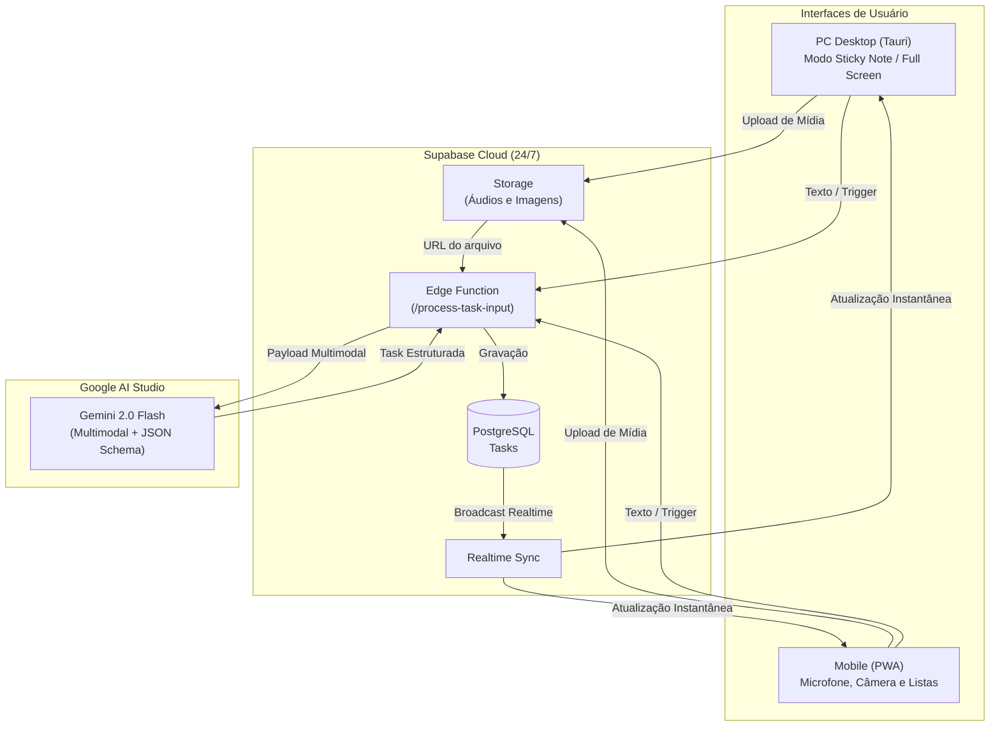

# TasksAnywhere 📌⚡

> **Capture tasks anywhere, anytime.** An open-source, AI-powered task management app with Desktop Sticky Note mode and Mobile PWA, driven by fine-grained signals.

[](LICENSE)
[](https://www.solidjs.com/)
[](https://www.typescriptlang.org/)
[](https://supabase.com/)
[](https://tauri.app/)
[](https://github.com/akitaonrails/ai-memory)

---

## 🌟 Visão Geral (Overview)

O **TasksAnywhere** foi concebido para resolver o atrito de anotar tarefas no dia a dia. Seja no computador enquanto joga ou programa, ou na rua pelo celular, você pode capturar tarefas instantaneamente falando por áudio, tirando uma foto ou digitando uma frase rápida.

### ✨ Destaques
* 🎙️ **Captura Multimodal por IA:** Envie áudios gravados pelo microfone, fotos de anotações ou textos curtos. O modelo **Gemini 2.0 Flash** processa diretamente o áudio/imagem e gera a tarefa com título, descrição, prioridade, data de vencimento e tags.
* 📌 **Modo Sticky Note no PC:** Janela compacta flutuante com *Always on Top* (sempre no topo) para você acompanhar as tarefas do dia sem ocupar espaço na tela. Expande com 1 clique para a visão completa de dashboard e calendário.
* 📱 **PWA Móvel:** Funciona em qualquer smartphone como aplicativo instalável, com suporte nativo a microfone e câmera.
* ⚡ **Reatividade Fina (SolidJS):** Arquitetura 100% orientada a Signals (`createSignal`, `createMemo`), espelhando o paradigma de UI declarativa do **Fusion** no Roblox (`Value`, `Computed`).
* ☁️ **Nuvem Independente 24/7:** Base de dados e autenticação gerenciadas via **Supabase** (Postgres + Storage + Realtime). O celular sincroniza com o PC mesmo se seu computador estiver desligado.
* 🧠 **Continuidade com ai-memory:** Mantém o histórico de arquitetura e decisões de engenharia sincronizado entre agentes e desenvolvedores através do [ai-memory](https://github.com/akitaonrails/ai-memory) do Fábio Akita.

---

## 🏗️ Arquitetura do Sistema



---

## 🛠️ Stack Tecnológica

| Camada | Tecnologia | Motivação |
| :--- | :--- | :--- |
| **Frontend** | [SolidJS](https://www.solidjs.com/) + [TypeScript](https://www.typescriptlang.org/) | Reatividade granular por Signals idêntica ao Fusion no Roblox, sem sobrecarga de Virtual DOM. |
| **Estilização** | [Tailwind CSS](https://tailwindcss.com/) | Design moderno, elegante, temas claro/escuro e micro-animações. |
| **Desktop** | [Tauri](https://tauri.app/) | Executável leve (~10 MB) para controle nativo da janela flutuante no Windows. |
| **Backend & Banco** | [Supabase](https://supabase.com/) | PostgreSQL com RLS, buckets de Storage para mídias e Edge Functions serverless. |
| **Inteligência Artificial** | [Gemini 2.0 Flash](https://ai.google.dev/) | Extração estruturada de tarefas com suporte nativo a áudio e visão. |
| **Memória de Engenharia**| [ai-memory](https://github.com/akitaonrails/ai-memory) | Preservação de contexto e decisões de arquitetura no desenvolvimento. |

---

## 🚀 Como Começar

### Pré-requisitos
* [Node.js](https://nodejs.org/) (versão 20 ou superior)
* [npm](https://www.npmjs.com/) ou [pnpm](https://pnpm.io/)
* [ai-memory](https://github.com/akitaonrails/ai-memory) instalado localmente

### 1. Clonar o repositório
```bash
git clone https://github.com/<seu-usuario>/TasksAnywhere.git
cd TasksAnywhere
```

### 2. Configurar variáveis de ambiente
Crie um arquivo `.env` a partir do modelo:
```bash
cp .env.example .env
```
Preencha com suas credenciais do **Supabase** e chave do **Gemini API**.

### 3. Rodar em desenvolvimento
```bash
npm install
npm run dev
```

---

## 📄 Licença

Distribuído sob a licença **MIT**. Consulte o arquivo [LICENSE](LICENSE) para obter mais informações.
